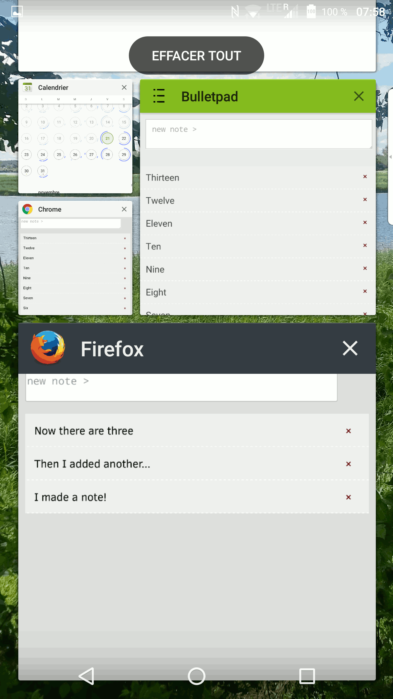

<!-- .slide: data-background-color="#262361" -->
## Taking Drupal 8 Sites Offline: airplane mode surfing!
# ✈
Ryan Weal

Kafei Interactive Inc.

New Jersy DrupalCamp 2017 (version 2)

Badcamp 2016 ~ San Francisco, California (version 1)

Formatted as slides here:
https://kafeiinteractif.github.io/offline-mode/#/

<!-- .slide: data-background-color="#262361" -->
## Why talk about offline?

 - Wifi not always on board aircraft
 - Travelling internationally without data
 - Bored while disconnected on the subway/métro
 - Networks can be slow, load time is slow
 - Adventure awaits (mountain climbing, islands, etc.)
 - Internet goes down due to IoT devices gone mad (new!)

<!-- .slide: data-background-color="#262361" -->
## What could offline replace?

 - Online-only activities
 - Native apps
 - Quests to reduce dns & http request time:
   - Server-side caching, reverse proxies, CDNs
   - Aggregation of resources, minification
   - BigPipe - pushing down the "shell" first

<!-- .slide: data-background-color="#262361" -->
## Planning for Offline 

 - What content do you *really* need when offline?
 - Is there functionality you need that you can sync?
 - Where do you direct your users when content is not available?
 - How long should your initial page load take?
   - People generally abandon requests of 10s or more.
 - Keep it light! 5MB or less is ideal.
   - Storage limits set by browser. See "The Offline Cookbook" for more details.

<!-- .slide: data-background-color="#262361" -->
## We have done things like this before!

 - Same origin - no CDN, embeds, AJAX*
 - Load the initial shell, the content, more?
 - Similar to Content Security Policy (CSP) needs
 - Also similar to expire headers

<!-- .slide: data-background-color="#39510f" -->
## appcache

 - Adds a metadata field to your HTML
 - Specifies a manifest file that lists resources
 - Downloads ALL the resources on the first page hit
 - Content is served locally first
 - Just works™

 - Depreciated (this is why we can't have nice things)
 - Can be overly simplistic, limited use cases

<!-- .slide: data-background-color="#39510f" -->
## Our first (non-Drupal) appcache site!

 - index.html
 - myapp.appcache (must be served as text/cache-manifest)
 - JavaScript (used ES6 in our demo, so use recent browser)
 - https://github.com/kafeiinteractif/bulletpad

<!-- .slide: data-background-color="#39510f" -->
## appcache index.html

    <!doctype html>
    <html manifest="bulletpad.appcache">
    <head>
      <meta charset="utf-8">
      <title>Bulletpad</title>
      
      
      <link rel="stylesheet" type="text/css" href="stylesheet.css">
      <meta name="viewport" content="width=device-width">
    </head>
    <body>
    
    

      <textarea v-model="newTodo" v-on:keyup.enter="addTodo" placeholder="new note >"></textarea>
      <ul>
        <li v-for="todo in todos | reverse">
          {{ todo.text }}
          <button v-on:click="removeTodo($index)">×</button>
        </li>
      </ul>
    

    
    </body>
    </html>
This uses vue.js, btw... we love it.

<!-- .slide: data-background-color="#39510f" -->
## appcache bulletpad.appcache
    CACHE MANIFEST
    # v11
    
    # assets
    CACHE:
    index.html
    stylesheet.css
    main.js
    vue.js
    
    NETWORK:
    *
No fallback in this case

(there is nothing that is not in the appcache here!)

<!-- .slide: data-background-color="#39510f" -->
## appcache demo app
https://kafeiinteractif.github.io/bulletpad/

<!-- .slide: data-background-color="#39510f" -->
## appcache debugging

 - Keep the console log open
 - Reload twice?
 - Update the serial "number" in manifest with each change

<!-- .slide: data-background-color="#39510f" -->
## appcache basics: further reading

"A Beginner's Guide to Using the Application Cache"
https://www.html5rocks.com/en/tutorials/appcache/beginner/

"Application Cache is a Douchebag"
http://alistapart.com/article/application-cache-is-a-douchebag

<!-- .slide: data-background-color="#685103" -->
## appcache drupal module

"Offline Application"

Made for Frontend United 2016 by swentel

https://www.drupal.org/project/offline_app

<!-- .slide: data-background-color="#685103" -->
## offline_app assumptions

 - All the content is going to fall under /offline/
 - Presumes you will have one level of alias, no / in paths!
 - Suppresses theme from rendering
 - Three new block regions
 - Does not load images or other assets on nodes
 - Will not let you set custom homepage fallback

Very tempting to try putting paths in first page of config... don't! Use the Content and Assets tabs.

<!-- .slide: data-background-color="#685103" -->
## offline_app setup

 - Enable permissions for anonymous user:
   - Access Application Cache manifest
   - Access Homescreen manifest
   - Access offline content

 - Add the manifest to pages using one of:
   - default behavior adds iframe to sidebar_first; or...
   - admin/config/services/offline-app checkbox for "Add the manifest attribute to the HTML tag..."

 - Clear the cache

<!-- .slide: data-background-color="#685103" -->
## offline_app content type configuration

 - Use content type manage display "custom display settings" to add either (or both) the "offline page" and "offline teaser" view modes.

 - After enabling view mode go to /admin/config/services/offline-app/content

 - Input a node path: beauty/node:1

 - Now /offline/beauty should return /node/1 (rebuild cache?)

<!-- .slide: data-background-color="#685103" -->
## offline_app views configuration

 - Add an "offline" display to the view

 - Show: "content" with "offline page" view mode

 - Reference it in our config:

    articles/view:super_awesome:offline_1

 - Now /offline/articles will show the view called "super_awesome" using the offline_1 variant

<!-- .slide: data-background-color="#685103" -->
## offline_app config complete

<!-- .slide: data-background-color="#685103" -->
## offline_app ... much wow!

<!-- .slide: data-background-color="#685103" -->
## offline_app potential problems!

 - New nodes not added to list automagically
 - Add stylesheets to your Assets list, but paths can change...
 - When to reload (or prompt user to reload)
 - No option for separate caches for shell/content
 - Visit the homepage, check that <html> tag has manifest reference

<!-- .slide: data-background-color="#685103" -->
## appcache and offline_app: further reading

"Let's make Drupal 8 available offline using appcache"
https://www.agiledrop.com/blog/lets-make-drupal-8-available-offline-using-appcache

<!-- .slide: data-background-color="#8B4524" -->
## Service Worker

 - Related to concept of "Progressive Web Apps" (PWA)
 - Can be added to user's Android homescreen
 - Loads the shell first, content appears later
 - Site assets for the shell cached locally for speed
 - Sounds a little like Big Pipe? Yep! Somewhat.
 - Our demo code: https://github.com/kafeiinteractif/bulletpad_pwa

<!-- .slide: data-background-color="#8B4524" -->
## Service Worker: Characteristics

 - Manifest file is now in JSON format
 - Requires JavaScript to register Service Worker
 - Recommended to do things like use "loading" icon
 - Code can target different stages: install / activate / fetch
 - You are free to create many types of caches for your data
 - Intercepts requets so you can choose offline or online content

<!-- .slide: data-background-color="#8B4524" -->
## Service Worker: Is it ready?

 - Check the status here: https://jakearchibald.github.io/isserviceworkerready/

 - Safari and Edge... this is why we can't have nice things!

 - Edge has support for *some* things but not yet usable for what we want. At least they are working on it though.

<!-- .slide: data-background-color="#8B4524" -->
Define the caches and context

    var cacheName = 'bulletpad-x6'; // app shell
    var filesToCache = [
      '/',
      '/index.html',
      '/main.js',
      '/vue.js',
      '/stylesheet.css',
      '/service-worker.js',
    ];

<!-- .slide: data-background-color="#8B4524" -->
Setting up our app by caching the shell

    self.addEventListener('install', function(e) {
      console.log('[ServiceWorker] Install');
      e.waitUntil(
        caches.open(cacheName).then(function(cache) {
          console.log('[ServiceWorker] Caching app shell');
          return cache.addAll(filesToCache);
        })
      );
    });

<!-- .slide: data-background-color="#8B4524" -->
Evil example code that breaks offline mode! \o/

    self.addEventListener('activate', function(e) {
      console.log('[ServiceWorker] Activate');
      e.waitUntil(
        caches.keys().then(function(keyList) {
          return Promise.all(keyList.map(function(key) {
            if (key !== cacheName) {
              console.log('[ServiceWorker] Removing old cache', key);
              return caches.delete(key);
            }
          }));
        })
      );
    });

<!-- .slide: data-background-color="#8B4524" -->
Oops, we destroyed cache on startup by using that code!

<!-- .slide: data-background-color="#8B4524" -->
Interceping any http request, serving local if possible!

    self.addEventListener('fetch', function(e) {
      console.log('[ServiceWorker] Fetch', e.request.url);
      e.respondWith(
        caches.match(e.request).then(function(response) {
          return response || fetch(e.request);
        })
      ); // iterate on your other caches
    });
Many alternate variations of this: can do cache-only, network-only, network-fallback, or race network vs. cache! Also: cache-then-network, or offline.html message... examples in "Offline Cookbook" (see last slide).

<!-- .slide: data-background-color="#8B4524" -->
## Service Worker debugging

 - Needs https or "localhost" domain to test/run
 - Update the cache key(s) with each revision
 - console_log is your friend
 - chrome://inspect/#service-workers
 - chrome://serviceworker-internals

<!-- .slide: data-background-color="#8B4524" -->
## Service Worker: potential problems

 - Every change *can* make the entire site re-download (design around this)
 - Cache can expire... if you delete cache on activate ;)
 - Devices have storage limits, query them! Find out if full.
 - No reload button for Chrome on Android (pull down to reload)

<!-- .slide: data-background-color="#8B4524" -->
## Service Worker demo
https://kafeiinteractif.github.io/bulletpad_pwa/

<!-- .slide: data-background-color="#8B4524" -->
### Service Worker pwa appears "standalone"

<!-- .slide: data-background-color="#8B4524" -->
## Service Worker Drupal Modules

"Progressive Web App" by nod

for Drupal 7 and Drupal 8

https://www.drupal.org/project/pwa

"Service Worker" by nod

No official release yet.

https://www.drupal.org/project/serviceworker

<!-- .slide: data-background-color="#8B4524" -->
## Service Worker PWA Drupal Module

 - has support for "installing" the site, icon config
 - choose standalone app, fullscreen mode, minimal UI
 - pick what URLs to cache on install
 - intended to help speed up CSS and JS

 - tries to be aware of images, etc. but does not cache them
 - cache key is hard to update

<!-- .slide: data-background-color="#8B4524" -->
## Service Worker: further reading

"Your First Progressive Web App"
https://developers.google.com/web/fundamentals/getting-started/codelabs/your-first-pwapp/

"Adding a Service Worker and Offline into your Web App"
https://developers.google.com/web/fundamentals/getting-started/codelabs/offline/

<!-- .slide: data-background-color="#8B4524" -->
## More Good Stuff

"The offline cookbook"
https://jakearchibald.com/2014/offline-cookbook/

"Web App Install Banners"
https://developers.google.com/web/fundamentals/engage-and-retain/app-install-banners/

<!-- .slide: data-background-color="#8B4524" -->
## Thanks!
# ✈

https://github.com/kafeiinteractif/offline-mode

https://twitter.com/ryan_weal
